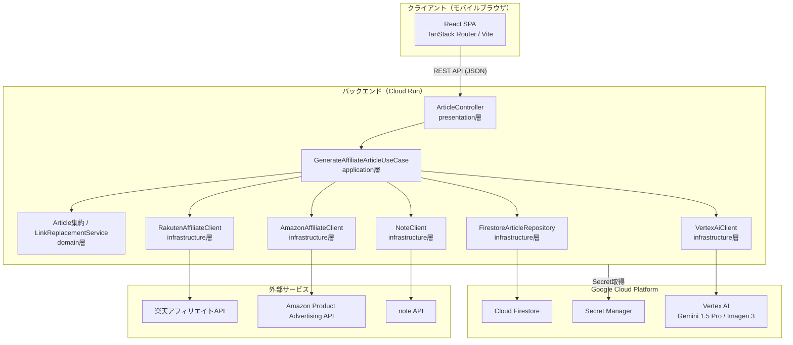
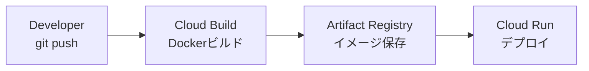
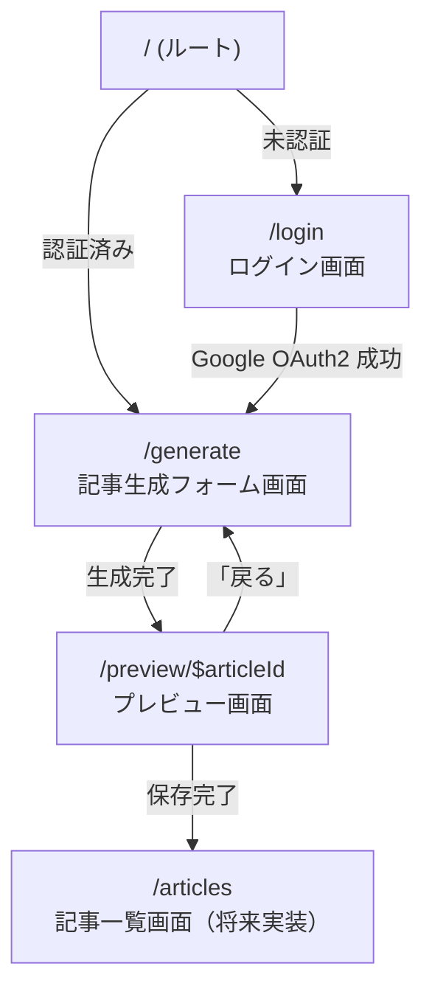

# 全体設計ドキュメント

**目的:** 実装前に合意すべき設計の全体像を定義する。本ドキュメントはアーキテクチャ・ドメイン・API・フロントエンドの設計判断を一元化し、開発チーム全員が同じ理解のもとで実装を進めるための基準書とする。

---

## 1. 設計概要

### 1.1 このドキュメントの目的

実装着手前に、以下の設計上の合意を確立する。

- システム全体のコンポーネント構成と責務分担
- ドメインモデルの設計判断とその根拠
- バックエンドREST APIの仕様（エンドポイント・DTO）
- アフィリエイトパイプラインのフローとエラー方針
- フロントエンドの画面構成とルーティング
- 非機能要件（セキュリティ・パフォーマンス・可用性）

### 1.2 設計方針

**ドメイン駆動設計（DDD）を採用する理由**

本プロジェクトのコアドメインは「アフィリエイト記事の生成・収益化」であり、以下の複雑性を内包する。

- 複数の外部API（楽天・Amazon・Vertex AI・note）の統合
- 商品選定ロジック（還元率比較）・リンク置換・SEO最適化といった固有のビジネスルール
- 将来の自動投稿・複数ASP対応に備えた拡張性

DDDを採用することで、これらの複雑なビジネスルールをドメイン層に隔離し、インフラ（DB・外部API）の変更がビジネスロジックに影響しない構造を実現する。詳細は `docs/layer/domain.md` を参照。

**モバイルファーストの方針**

ビジョン「数タップで収益化記事を生成・投稿する」を実現するため、UIは常にモバイル画面サイズを基準に設計する。入力フォームの項目数は最小限に絞り、プレビューもモバイル表示で確認する。

---

## 2. システム全体構成

### 2.1 アーキテクチャ図



### 2.2 CI/CDパイプライン



### 2.3 コンポーネント役割一覧

| コンポーネント | 層 | 役割 |
|---|---|---|
| React SPA | Frontend | モバイル最適化UI。フォーム入力・プレビュー・保存操作 |
| `ArticleController` | presentation | HTTPリクエスト受付・バリデーション・レスポンス返却 |
| `GenerateAffiliateArticleUseCase` | application | パイプライン全体のオーケストレーション |
| `Article` 集約 | domain | 記事ドメインのビジネスルールを保持する集約ルート |
| `LinkReplacementService` | domain | プレースホルダーをアフィリエイトリンクへ置換するドメインサービス |
| `FirestoreArticleRepository` | infrastructure | Firestoreへの永続化 |
| `VertexAiClient` | infrastructure | Gemini（記事・キーワード生成）・Imagen 3（画像生成）の呼び出し |
| `RakutenAffiliateClient` | infrastructure | 楽天アフィリエイトAPI連携 |
| `AmazonAffiliateClient` | infrastructure | Amazon Product Advertising API連携 |
| `NoteClient` | infrastructure | noteへの下書き一時保存 |

---

## 3. ドメイン設計

ドメインモデルの詳細（クラス図・集約境界図・コード）は `docs/domain/domain-model-diagram.md` および `docs/layer/domain.md` を正とする。ここでは設計判断の根拠を記録する。

### 3.1 Article を集約ルートにした理由

`Article` はこのドメインにおける唯一の集約ルートである。以下の理由でこの境界を選択した。

**ライフサイクルの一致:** 本文（`Content`）・画像（`Image`）・SEOキーワード（`SeoKeyword`）・商品リンク群（`ProductLinks`）はすべて同一の記事生成トランザクション内で生まれ、記事削除とともに消滅する。独立したライフサイクルを持たないため、別集約に分離する必要がない。

**不変条件の一元管理:** 「本文中のプレースホルダー数とアフィリエイトリンク数が一致しなければならない」というビジネスルールは、`Article` 内でのみ検証できる。`injectLinks(service)` メソッドがこの不変条件を維持する責務を担う。

**将来の境界分割:** 画像管理や下書き管理が独立したユースケースを持つ規模に成長した場合、後から境界を分割できる。MVPでは `Article` に集約することで設計をシンプルに保つ。

### 3.2 値オブジェクトの設計判断

**`ProductInfo` を値オブジェクトにした理由**

`ProductInfo` はアフィリエイトAPIから取得した商品スナップショットであり、独自のアイデンティティを持たない。「同じ名前・価格・カテゴリを持つ商品情報は同一」とみなせるため、値オブジェクトとして実装する。また `ProductInfo` の変更は常に `AffiliateLink` ごと新規生成することで、不変性を保証する。

**`Content` を値オブジェクトにした理由**

本文テキストは「変更」ではなく「生成し直す」という操作モデルがドメイン的に自然である。リンク置換後の `Content` は `copy()` で新たなインスタンスとして生成し、元の `Content` は変更しない。これにより `LinkReplacementService` が副作用なく動作する。

**`SeoKeyword` をインラインバリュークラスにした理由**

`SeoKeyword` は単一の `String` をラップするが、「空文字列のキーワードは存在してはならない」という不変条件を型レベルで表現するためにラップしている。`@JvmInline value class` を使用することでランタイムのオーバーヘッドを最小化する。

### 3.3 LinkReplacementService をドメインサービスにした理由

リンク置換は `Content` と `ProductLinks` の両方を参照して初めて実行できる処理である。どちらか一方の値オブジェクトに持たせると、もう一方を引数として受け取ることになり責務の所在が曖昧になる。複数のドメインオブジェクトをまたぐロジックはドメインサービスに置く原則に従い、`LinkReplacementService` としてドメイン層に定義する。インフラ依存を持たないため、純粋なドメインロジックとして実装できる。

---

## 4. バックエンド API 設計

### 4.1 エンドポイント一覧

| メソッド | パス | 説明 | 認証 |
|---|---|---|---|
| `POST` | `/api/articles/generate` | 記事生成・DB保存・note一時保存を一括実行 | 必須 |
| `GET` | `/api/articles/{id}` | 記事を1件取得 | 必須 |
| `GET` | `/api/articles` | 記事一覧を取得 | 必須 |
| `DELETE` | `/api/articles/{id}` | 記事を削除 | 必須 |

すべての `/api/**` エンドポイントは Google OAuth2 による認証を必須とする（`SecurityConfig` 参照）。

### 4.2 POST /api/articles/generate

**リクエスト**

```json
{
  "theme": "登山初心者向けトレッキングシューズ おすすめ",
  "imagePrompt": "山道を歩く登山者のシューズのクローズアップ、自然光",
  "targetAudience": "登山を始めたばかりの20〜40代",
  "affiliatePlatforms": ["RAKUTEN", "AMAZON"]
}
```

| フィールド | 型 | 必須 | 説明 |
|---|---|---|---|
| `theme` | String | Yes | 記事テーマ。SEOキーワード抽出・記事生成の起点 |
| `imagePrompt` | String | Yes | Imagen 3に渡す画像生成プロンプト |
| `targetAudience` | String | No | 想定読者。記事トーン調整に使用 |
| `affiliatePlatforms` | List\<String\> | No | 使用するASP。デフォルトは両方 |

**レスポンス（200 OK）**

```json
{
  "articleId": "550e8400-e29b-41d4-a716-446655440000",
  "title": "登山初心者必見！おすすめトレッキングシューズ5選",
  "content": "...(本文テキスト)...",
  "imageUrl": "https://storage.googleapis.com/...",
  "affiliateLinks": [
    {
      "url": "https://hb.afl.rakuten.co.jp/...",
      "trackingId": "rakuten-xxxx",
      "platform": "RAKUTEN",
      "productName": "モンベル トレッキングシューズ",
      "price": 18700
    }
  ],
  "status": "NOTE_DRAFTED"
}
```

**エラーレスポンス**

```json
{
  "error": {
    "code": "VALIDATION_ERROR",
    "message": "リクエストが不正です",
    "details": [
      { "field": "theme", "message": "テーマは必須です" }
    ]
  }
}
```

| HTTPステータス | コード | 発生条件 |
|---|---|---|
| 400 | `VALIDATION_ERROR` | `theme` または `imagePrompt` が空 |
| 401 | `UNAUTHORIZED` | 未認証リクエスト |
| 503 | `AI_SERVICE_UNAVAILABLE` | Vertex AI が応答しない |
| 503 | `AFFILIATE_API_UNAVAILABLE` | 楽天・Amazon API が両方とも失敗 |

### 4.3 GET /api/articles/{id}

**レスポンス（200 OK）**

```json
{
  "articleId": "550e8400-e29b-41d4-a716-446655440000",
  "title": "登山初心者必見！おすすめトレッキングシューズ5選",
  "content": "...",
  "imageUrl": "https://storage.googleapis.com/...",
  "affiliateLinks": [...],
  "status": "NOTE_DRAFTED"
}
```

| HTTPステータス | 発生条件 |
|---|---|
| 404 | 指定IDの記事が存在しない |

### 4.4 GET /api/articles

**レスポンス（200 OK）**

```json
[
  {
    "articleId": "...",
    "title": "...",
    "status": "NOTE_DRAFTED"
  }
]
```

一覧では `title` と `status` のサマリーのみを返す。本文・画像URLは詳細取得（`GET /api/articles/{id}`）で取得する。

### 4.5 DELETE /api/articles/{id}

**レスポンス（204 No Content）**

ボディなし。Firestoreから論理削除ではなく物理削除を行う。

---

## 5. アフィリエイトパイプライン設計

### 5.1 パイプライン全体フロー

```mermaid
sequenceDiagram
    participant FE as Frontend
    participant CTRL as ArticleController
    participant UC as GenerateAffiliateArticleUseCase
    participant Gemini as VertexAiClient (Gemini)
    participant Imagen as VertexAiClient (Imagen 3)
    participant AFF as AffiliateApiClient
    participant LRS as LinkReplacementService
    participant Repo as FirestoreArticleRepository
    participant Note as NoteClient

    FE->>CTRL: POST /api/articles/generate
    CTRL->>UC: execute(input)

    Note over UC,Gemini: Step 1: キーワード抽出
    UC->>Gemini: extractKeywords(theme)
    Gemini-->>UC: List<SeoKeyword>

    Note over UC,AFF: Step 2: 商品検索（楽天・Amazon並列）
    UC->>AFF: searchProducts(keywords, platforms)
    AFF-->>UC: List<ProductInfo>（還元率優先でソート済み）

    Note over UC,Imagen: Step 3: 記事・画像生成（並列）
    UC->>Gemini: generateContent(theme, keywords, products)
    UC->>Imagen: generateImage(imagePrompt)
    Gemini-->>UC: Content（プレースホルダー付き）
    Imagen-->>UC: Image

    Note over UC,LRS: Step 4: リンク置換
    UC->>LRS: replace(content, productLinks)
    LRS-->>UC: Content（アフィリエイトリンク埋め込み済み）

    Note over UC,Repo: Step 5: 永続化
    UC->>Repo: save(article.markAsSaved())
    Repo-->>UC: Article (status=SAVED)

    Note over UC,Note: Step 6: note一時保存
    UC->>Note: postDraft(article)
    Note-->>UC: NotePostResult
    UC->>Repo: save(article.markAsDrafted())

    UC-->>CTRL: GenerateArticleOutput
    CTRL-->>FE: 200 OK（記事データ）
```

### 5.2 楽天 vs Amazon 選択ロジック

楽天とAmazonの両APIを対象に商品検索を行い、**アフィリエイト還元率が高い方の商品を優先採用**する。

```
選択基準:
1. 同一カテゴリ商品が両APIで取得できた場合 → 還元率（commission rate）が高い方を採用
2. 片方のAPIのみで商品が取得できた場合 → そのAPIの商品を採用
3. 商品価格が同程度（±10%）の場合 → 還元率で決定
```

`AffiliateApiClient` インターフェースを楽天・Amazon双方が実装し、`GenerateAffiliateArticleUseCase` 内でマージ・ソートを行う。ドメインロジックではなくユースケースで選択することで、将来の選択基準変更（例：価格帯・ブランド・在庫）に柔軟に対応できる。

### 5.3 エラー時のフォールバック方針

| 障害ポイント | フォールバック |
|---|---|
| 楽天API障害 | Amazonのみで商品検索を続行 |
| Amazon API障害 | 楽天のみで商品検索を続行 |
| 両方のアフィリエイトAPI障害 | `AFFILIATE_API_UNAVAILABLE (503)` をクライアントに返す |
| Gemini（記事生成）障害 | リトライ最大3回（Exponential Backoff）後に `AI_SERVICE_UNAVAILABLE (503)` |
| Imagen（画像生成）障害 | デフォルト画像URLを使用し記事生成を継続 |
| note API障害 | note投稿を省略し `status=SAVED` の記事をレスポンスとして返す（DBへの保存は完了） |
| Firestore書き込み失敗 | アプリケーション層でロールバックし `500` を返す |

外部APIへのリトライ処理の詳細は `docs/layer/infrastructure.md` を参照。

---

## 6. フロントエンド画面設計

### 6.1 画面遷移図



### 6.2 TanStack Router ルート設計

| パス | コンポーネント | 説明 |
|---|---|---|
| `/` | `RootRoute` | 認証状態に応じてリダイレクト |
| `/login` | `LoginPage` | Google OAuth2 ログイン画面 |
| `/generate` | `GeneratePage` | 記事生成フォーム（認証ガード付き） |
| `/preview/$articleId` | `PreviewPage` | 生成結果プレビュー（パスパラメータで記事ID） |

型安全なルーティングのため、TanStack Router の `createFileRoute` を使用してルートを定義する。パスパラメータ `$articleId` は文字列として型付けされる。

### 6.3 各画面の詳細

#### ログイン画面（`/login`）

**役割:** 新規ユーザーの登録と既存ユーザーのログインを単一の画面で提供する。

**主要コンポーネント:**

| コンポーネント | 役割 |
|---|---|
| `LoginPage` | ページルートコンポーネント。認証済みなら `/generate` へリダイレクト |
| `GoogleSignInButton` | Google OAuth2 ログインボタン。クリックで Spring Security の OAuth2エンドポイントへリダイレクト |
| `AppLogo` | ビジョン「収益をデザインする」を体現するブランドロゴ |

**設計上の考慮:**

- 新規登録と既存ログインは Google OAuth2 が自動判別するため、UI上でフローを分ける必要がない
- モバイルで押しやすいよう、ボタン高さは最低 `48px` を確保する

#### 記事生成フォーム画面（`/generate`）

**役割:** ユーザーが記事生成に必要な入力項目を入力し、AI生成をトリガーする画面。

**主要コンポーネント:**

| コンポーネント | 役割 |
|---|---|
| `GeneratePage` | ページルートコンポーネント。フォーム状態とAPI呼び出しを管理 |
| `ArticleGenerateForm` | フォームUI。入力バリデーションを担う |
| `ThemeInput` | 記事テーマ入力欄（必須） |
| `ImagePromptInput` | 画像プロンプト入力欄（必須） |
| `TargetAudienceInput` | 想定読者入力欄（任意） |
| `ArticleStyleSelector` | 記事スタイルセレクト（必須） |
| `AffiliatePlatformSelector` | アフィリエイトASP チェックボックス（必須、複数選択可） |
| `WordCountSelector` | 文字数目安セレクト（任意） |
| `GenerateButton` | 生成ボタン。生成中はスピナーを表示しボタンを無効化 |
| `GenerationProgress` | 生成中のステップ表示（キーワード抽出中/商品検索中/記事生成中/画像生成中）|

**入力項目設計詳細:**

| フィールド名 | 型 | 必須 | 最大文字数 | バリデーション | プレースホルダー例 |
|---|---|---|---|---|---|
| テーマ | テキスト | ✅ | 100 | 空でない、1文字以上100文字以内 | 「登山初心者向けトレッキングシューズ おすすめ」 |
| 画像プロンプト | テキストエリア | ✅ | 300 | 空でない、1文字以上300文字以内 | 「山道を歩く登山者のシューズのクローズアップ、自然光、鮮やかな色」 |
| ターゲット読者 | テキスト | 任意 | 100 | 0〜100文字 | 「登山を始めたばかりの20〜40代」 |
| 記事スタイル | セレクト | ✅ | - | 体験談/比較/解説/ランキング のいずれか | 「比較」 |
| アフィリエイトASP | チェックボックス | ✅ | - | 楽天・Amazon のいずれか以上を選択 | 楽天にチェック、Amazonにチェック |
| 文字数目安 | セレクト | 任意 | - | 1000/2000/3000 のいずれか、または未指定 | 「2000」 |

**フォームのバリデーションロジック:**

```typescript
type GenerateFormInput = {
  theme: string;
  imagePrompt: string;
  targetAudience?: string;
  articleStyle: 'EXPERIENCE' | 'COMPARISON' | 'EXPLANATION' | 'RANKING';
  affiliatePlatforms: ('RAKUTEN' | 'AMAZON')[];
  wordCount?: 1000 | 2000 | 3000;
};

function validateForm(input: GenerateFormInput): Record<string, string> {
  const errors: Record<string, string> = {};

  if (!input.theme?.trim()) {
    errors.theme = 'テーマは必須です';
  } else if (input.theme.length > 100) {
    errors.theme = 'テーマは100文字以内です';
  }

  if (!input.imagePrompt?.trim()) {
    errors.imagePrompt = '画像プロンプトは必須です';
  } else if (input.imagePrompt.length > 300) {
    errors.imagePrompt = '画像プロンプトは300文字以内です';
  }

  if (input.targetAudience && input.targetAudience.length > 100) {
    errors.targetAudience = 'ターゲット読者は100文字以内です';
  }

  if (!input.articleStyle) {
    errors.articleStyle = '記事スタイルを選択してください';
  }

  if (!input.affiliatePlatforms || input.affiliatePlatforms.length === 0) {
    errors.affiliatePlatforms = 'アフィリエイトASPを1つ以上選択してください';
  }

  return errors;
}
```

#### ローディング状態の設計

**AI生成中のUX:**

生成処理は最大30秒程度かかるため、フロントエンドではリアルタイムなステップ表示でユーザーの待機ストレスを軽減する。

**ステップと目安時間:**

| ステップ | 説明 | 目安時間 |
|---|---|---|
| キーワード抽出中 | テーマからSEOキーワードを抽出 | 3〜5秒 |
| 商品検索中 | 楽天・Amazonで商品を並列検索 | 4〜7秒 |
| 記事生成中 | Gemini で本文を生成・キーワード埋め込み | 10〜15秒 |
| 画像生成中 | Imagen 3 でアイキャッチ画像を生成 | 5〜8秒 |
| 最終処理中 | リンク置換・DB保存・note投稿 | 2〜3秒 |

**進捗表示コンポーネント実装例:**

```typescript
type GenerationStep = 'KEYWORDS' | 'SEARCH' | 'CONTENT' | 'IMAGE' | 'FINALIZE';
type GenerationStepStatus = 'pending' | 'in-progress' | 'completed' | 'error';

interface GenerationProgressState {
  currentStep: GenerationStep;
  stepStatus: Record<GenerationStep, GenerationStepStatus>;
  elapsedSeconds: number;
  estimatedTotalSeconds: number;
}

interface GenerationProgressProps {
  state: GenerationProgressState;
}

export const GenerationProgress: React.FC<GenerationProgressProps> = ({ state }) => {
  const steps: { key: GenerationStep; label: string }[] = [
    { key: 'KEYWORDS', label: 'キーワード抽出中' },
    { key: 'SEARCH', label: '商品検索中' },
    { key: 'CONTENT', label: '記事生成中' },
    { key: 'IMAGE', label: '画像生成中' },
    { key: 'FINALIZE', label: '最終処理中' },
  ];

  return (
    <div className="generation-progress">
      <div className="progress-timeline">
        {steps.map((step) => {
          const status = state.stepStatus[step.key];
          return (
            <div key={step.key} className={`step step-${status}`}>
              <div className="step-icon">
                {status === 'completed' && <CheckIcon />}
                {status === 'in-progress' && <SpinnerIcon />}
                {status === 'pending' && <CircleIcon />}
                {status === 'error' && <ErrorIcon />}
              </div>
              <div className="step-label">{step.label}</div>
            </div>
          );
        })}
      </div>
      <div className="progress-info">
        <p className="elapsed-time">
          {state.elapsedSeconds}秒 / {state.estimatedTotalSeconds}秒（予定）
        </p>
        <div className="progress-bar">
          <div
            className="progress-fill"
            style={{
              width: `${(state.elapsedSeconds / state.estimatedTotalSeconds) * 100}%`,
            }}
          />
        </div>
      </div>
    </div>
  );
};
```

#### エラー状態の設計

**API失敗時のユーザー向けメッセージ:**

| HTTPステータス | エラーコード | 表示メッセージ | リカバリーアクション |
|---|---|---|---|
| 400 | `VALIDATION_ERROR` | 「入力内容が正しくありません。テーマと画像プロンプトを確認してください」 | フォーム入力の修正ボタン表示 |
| 401 | `UNAUTHORIZED` | 「認証が失効しました。再度ログインしてください」 | ログイン画面へのリダイレクト |
| 503 | `AI_SERVICE_UNAVAILABLE` | 「AI処理が一時的に利用できません。しばらく経ってから再度お試しください」 | 「リトライ」ボタン表示（3回まで） |
| 503 | `AFFILIATE_API_UNAVAILABLE` | 「商品情報が一時的に取得できません。しばらく経ってから再度お試しください」 | 「リトライ」ボタン表示（3回まで） |
| 500 | `INTERNAL_SERVER_ERROR` | 「予期しないエラーが発生しました。サポートにお問い合わせください」 | サポートメール送信ボタン |

**エラー処理フロー:**

```typescript
type GenerationError = {
  code: 'VALIDATION_ERROR' | 'UNAUTHORIZED' | 'AI_SERVICE_UNAVAILABLE' | 'AFFILIATE_API_UNAVAILABLE' | 'INTERNAL_SERVER_ERROR';
  message: string;
  retryable: boolean;
};

interface ErrorModalProps {
  error: GenerationError;
  onRetry: () => void;
  onDismiss: () => void;
  retryCount: number;
  maxRetries: number;
}

export const ErrorModal: React.FC<ErrorModalProps> = ({
  error,
  onRetry,
  onDismiss,
  retryCount,
  maxRetries,
}) => {
  const canRetry = error.retryable && retryCount < maxRetries;
  const userMessage = getUserFriendlyMessage(error.code);

  return (
    <div className="error-modal">
      <div className="error-icon">
        <AlertIcon />
      </div>
      <h2>生成に失敗しました</h2>
      <p className="error-message">{userMessage}</p>
      <div className="error-actions">
        {canRetry && (
          <button onClick={onRetry} className="btn btn-primary">
            リトライ（{retryCount + 1}/{maxRetries}）
          </button>
        )}
        {!canRetry && error.code === 'INTERNAL_SERVER_ERROR' && (
          <a href={`mailto:support@example.com?subject=記事生成エラー`} className="btn btn-secondary">
            サポートに連絡
          </a>
        )}
        <button onClick={onDismiss} className="btn btn-tertiary">
          フォームに戻る
        </button>
      </div>
    </div>
  );
};

function getUserFriendlyMessage(code: GenerationError['code']): string {
  const messages: Record<GenerationError['code'], string> = {
    VALIDATION_ERROR: '入力内容が正しくありません。テーマと画像プロンプトを確認してください',
    UNAUTHORIZED: '認証が失効しました。再度ログインしてください',
    AI_SERVICE_UNAVAILABLE: 'AI処理が一時的に利用できません。しばらく経ってから再度お試しください',
    AFFILIATE_API_UNAVAILABLE: '商品情報が一時的に取得できません。しばらく経ってから再度お試しください',
    INTERNAL_SERVER_ERROR: '予期しないエラーが発生しました。サポートにお問い合わせください',
  };
  return messages[code];
}
```

#### プレビュー画面（`/preview/$articleId`）

**役割:** AI が生成した記事・画像・アフィリエイトリンクをモバイル画面でプレビューし、保存操作を行う画面。

**主要コンポーネント:**

| コンポーネント | 役割 |
|---|---|
| `PreviewPage` | ページルートコンポーネント。`articleId` でAPIから記事データを取得 |
| `ArticlePreview` | 記事本文のモバイルプレビュー表示 |
| `EyeCatchPreview` | アイキャッチ画像のプレビュー表示 |
| `AffiliateLinkList` | 埋め込まれたアフィリエイトリンク一覧 |
| `SaveButton` | 保存ボタン。押下でnote一時保存済み状態を確認・完了表示 |
| `BackButton` | フォーム画面に戻るボタン |

**設計上の考慮:**

- プレビューは `POST /api/articles/generate` のレスポンスデータを使用し、追加のAPI呼び出しを省く
- 保存完了後は「noteで確認する」リンクをトースト通知で表示する

### 6.4 TanStack Router ルート定義コード例

`TanStack Router` を使用した型安全なルーティング実装例：

```typescript
// src/router.ts
import { RootRoute, Route, Router } from '@tanstack/react-router';
import { RootLayout } from './layouts/RootLayout';
import { LoginPage } from './pages/LoginPage';
import { GeneratePage } from './pages/GeneratePage';
import { PreviewPage } from './pages/PreviewPage';

// ルートレイアウト
const rootRoute = new RootRoute({
  component: RootLayout,
});

// ログイン画面
const loginRoute = new Route({
  getParentRoute: () => rootRoute,
  path: '/login',
  component: LoginPage,
});

// 記事生成フォーム画面（認証ガード付き）
const generateRoute = new Route({
  getParentRoute: () => rootRoute,
  path: '/generate',
  component: GeneratePage,
  beforeLoad: async ({ context }) => {
    if (!context.isAuthenticated) {
      throw redirect({
        to: '/login',
        replace: true,
      });
    }
  },
});

// プレビュー画面
const previewRoute = new Route({
  getParentRoute: () => rootRoute,
  path: '/preview/$articleId',
  component: PreviewPage,
  beforeLoad: async ({ context }) => {
    if (!context.isAuthenticated) {
      throw redirect({
        to: '/login',
        replace: true,
      });
    }
  },
});

// ルーター構築
const routeTree = rootRoute.addChildren([loginRoute, generateRoute, previewRoute]);

export const router = new Router({
  routeTree,
  context: {
    isAuthenticated: false, // 初期値。認証状態でセット
  },
});

// 型定義登録（TypeScript）
declare module '@tanstack/react-router' {
  interface Register {
    router: typeof router;
  }
}
```

**型安全なリンク生成:**

```typescript
// どのコンポーネントからでも
import { Link } from '@tanstack/react-router';

// 型チェック付きリンク
<Link to="/generate">記事生成へ</Link>
<Link to="/preview/$articleId" params={{ articleId: 'abc-123' }}>プレビュー</Link>

// プログラマティックナビゲーション
const router = useRouter();
await router.navigate({ to: '/preview/$articleId', params: { articleId: article.id } });
```

### 6.5 状態管理方針

フロントエンドの状態管理は、データの「所有者」と「ライフサイクル」に基づいて以下のように設計する：

**1. URL State（パスパラメータ・クエリパラメータ）**

- **用途**: 画面間で共有・永続化すべき状態
- **例**: プレビュー画面の `$articleId`、フォーム画面のキャッシュキー
- **実装**: TanStack Router の `useSearch()`, `useParams()`

```typescript
// プレビュー画面で記事IDを取得
const { articleId } = useParams({ from: '/preview/$articleId' });
```

**2. Component State（React State / useState）**

- **用途**: 単一コンポーネント内ローカルな状態
- **例**: フォーム入力値、エラーメッセージ表示フラグ、ローディング状態
- **実装**: `useState()` または `useReducer()`

```typescript
// フォーム入力値の管理
const [formInput, setFormInput] = useState<GenerateFormInput>({
  theme: '',
  imagePrompt: '',
  articleStyle: 'COMPARISON',
  affiliatePlatforms: [],
});

const [isLoading, setIsLoading] = useState(false);
const [error, setError] = useState<GenerationError | null>(null);
```

**3. Server State（API レスポンスキャッシュ）**

- **用途**: サーバーから取得したデータ（API レスポンス）
- **例**: 生成済みの記事データ、ユーザープロフィール
- **実装**: `TanStack Query (useQuery)` または `SWR`
- **キャッシュ戦略**: `staleTime: 5分`, `gcTime: 30分`

```typescript
import { useQuery } from '@tanstack/react-query';

// プレビュー画面：記事データをキャッシュから取得
const { data: article, isLoading } = useQuery({
  queryKey: ['article', articleId],
  queryFn: async () => {
    const response = await fetch(`/api/articles/${articleId}`);
    return response.json();
  },
  staleTime: 1000 * 60 * 5, // 5分間はキャッシュ有効
});
```

**4. Global State（認証状態）**

- **用途**: アプリケーション全体で共有する状態（認証ユーザー情報）
- **例**: `isAuthenticated`, `userId`, `userName`
- **実装**: Context API + `useContext()`, または Zustand/Redux

```typescript
// AuthContext の定義
const AuthContext = createContext<{
  isAuthenticated: boolean;
  user: User | null;
  login: (user: User) => void;
  logout: () => void;
} | null>(null);

export const useAuth = () => {
  const context = useContext(AuthContext);
  if (!context) {
    throw new Error('useAuth must be used within AuthProvider');
  }
  return context;
};

// コンポーネント内での利用
const { isAuthenticated, user } = useAuth();
```

**状態管理の配置図:**

```
┌─────────────────────────────────────────────┐
│ Global State (Context)                      │
│ - isAuthenticated                           │
│ - userId, userName                          │
└─────────────────────────────────────────────┘
           │
      ┌────┴────┐
      ▼         ▼
 ┌────────┐ ┌─────────────┐
 │ Router │ │ QueryClient │
 └────────┘ └─────────────┘
   │           │
   URL State   Server State
   ▼           ▼
 ├─ /login    ├─ GET /api/articles/{id}
 ├─ /generate ├─ GET /api/articles
 └─ /preview/ └─ ...cache...
      │
      Component State
      ▼
   ├─ formInput (useState)
   ├─ isLoading (useState)
   └─ error (useState)
```

**ベストプラクティス:**

- URL State は永続化・共有するため、bookmarkable な設計にする
- Server State は TanStack Query のキャッシュに任せる（重複フェッチ防止）
- Component State は最小限に（props drilling を避けるため Context 活用）
- Global State は認証など本当に全体で必要なものだけに限定

---

## 7. 非機能要件・制約

### 7.1 セキュリティ

| 要件 | 実装方針 |
|---|---|
| APIキー管理 | すべてのAPIキー・シークレットを Google Cloud Secret Manager で管理。ハードコード厳禁 |
| 認証 | Spring Security + Google OAuth2。`/api/**` はすべて認証必須 |
| GCPアクセス | Workload Identity を使用。サービスアカウントキーファイルを使用しない |
| CSRF | REST API はステートレスであるため `csrf().disable()` |
| CORS | Frontendオリジンのみを許可リストに追加 |

Secret Manager の設定例は `docs/layer/infrastructure.md` を参照。

### 7.2 パフォーマンス目標

| 処理 | 目標レスポンスタイム |
|---|---|
| `POST /api/articles/generate`（記事生成全体） | 30秒以内（Vertex AI の処理時間を含む） |
| `GET /api/articles/{id}` | 500ms以内 |
| `GET /api/articles` | 1秒以内 |
| フロントエンド初期ロード（LCP） | 3秒以内（モバイル回線） |

記事生成は30秒程度かかる可能性があるため、フロントエンドでは生成ステップをリアルタイム表示してユーザーの待機ストレスを軽減する。

### 7.3 可用性・スケーリング方針

| 項目 | 方針 |
|---|---|
| Cloud Run 最小インスタンス数 | 0（コスト最適化。コールドスタートはMVPでは許容） |
| Cloud Run 最大インスタンス数 | 3（MVPスコープ。トラフィック増加時に調整） |
| タイムアウト設定 | Cloud Run リクエストタイムアウト: 60秒（記事生成の30秒 + バッファ） |
| Firestore | マネージドサービスのためスケーリング管理不要 |

### 7.4 今後の拡張ポイント

| 拡張機能 | 設計上の考慮 |
|---|---|
| note 自動公開投稿 | `ArticleStatus` に `NOTE_PUBLISHED` を追加。`NoteClient` に `publish()` メソッドを追加するだけでドメインモデル変更は最小 |
| 複数ASP対応（A8.net・バリューコマース等） | `AffiliateApiClient` インターフェースを新しいクライアントが実装するだけ。ユースケースの変更不要 |
| AI自動品質レビュー | `Article.injectLinks()` の後にレビューステップを挿入。`QualityReviewService` をドメインサービスとして追加 |
| 記事編集機能 | `Article` に `updateContent(content: Content)` メソッドを追加。`PUT /api/articles/{id}` エンドポイントを追加 |
| 複数ユーザー対応 | `Article` に `ownerId` を追加し、`ArticleRepository` のクエリにユーザーフィルタを追加 |
