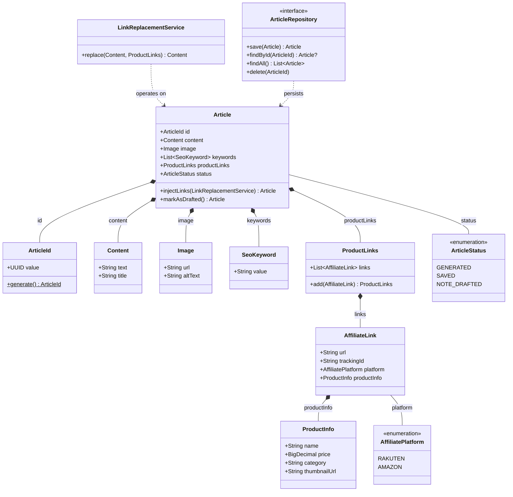
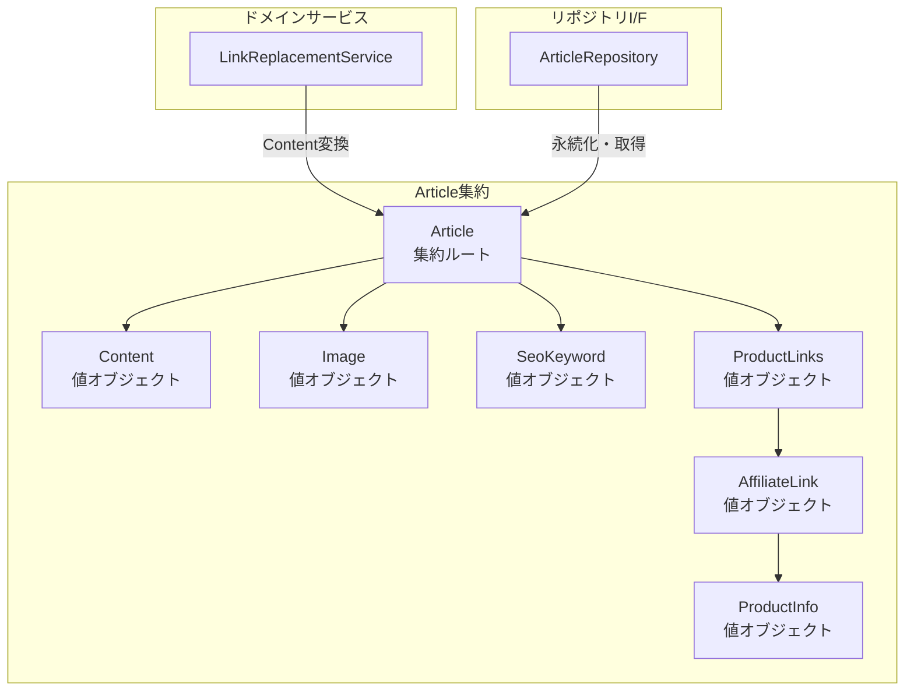

# ドメインモデル図

## クラス図



## 集約境界



## アフィリエイトパイプラインのフロー

```mermaid
sequenceDiagram
    participant UC as GenerateAffiliateArticleUseCase
    participant GeminiClient as VertexAiClient (Gemini)
    participant AffAPI as AffiliateApiClient
    participant LRS as LinkReplacementService
    participant Repo as ArticleRepository
    participant Note as NoteClient

    UC->>GeminiClient: extractKeywords(input)
    GeminiClient-->>UC: List~SeoKeyword~

    UC->>AffAPI: searchProducts(keywords)
    AffAPI-->>UC: List~ProductInfo~

    UC->>GeminiClient: generateContent(input, keywords, products)
    GeminiClient-->>UC: Content (with placeholders)

    UC->>LRS: replace(content, productLinks)
    LRS-->>UC: Content (with affiliate links)

    UC->>Repo: save(article)
    Repo-->>UC: Article

    UC->>Note: postDraft(article)
    Note-->>UC: NotePostResult
```
