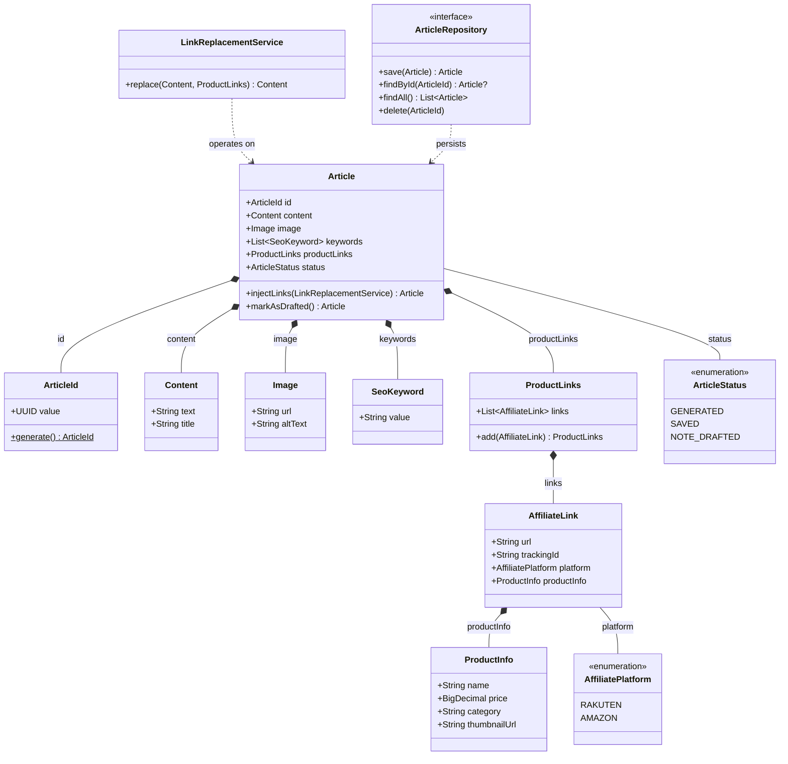
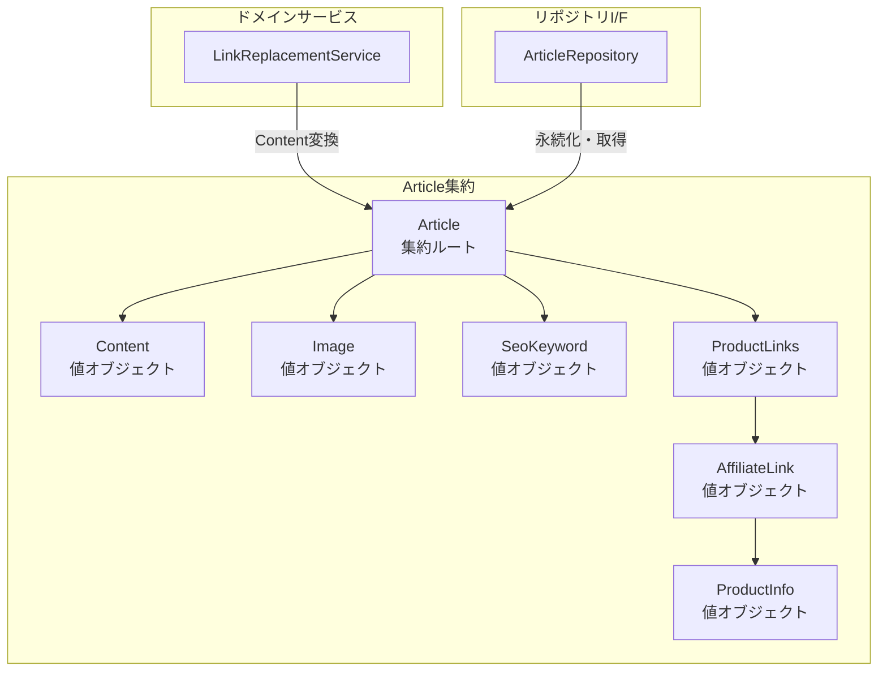
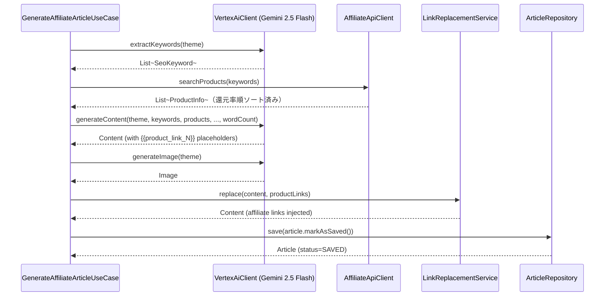

# ドメインモデル図

## クラス図

```mermaid
classDiagram
    class Article {
        +ArticleId id
        +Content content
        +Image image
        +List~SeoKeyword~ keywords
        +ProductLinks productLinks
        +ArticleStatus status
        +injectLinks(LinkReplacementService) Article
        +markAsDrafted() Article
    }

    class ArticleId {
        +UUID value
        +generate() ArticleId$
    }

    class Content {
        +String text
        +String title
    }

    class Image {
        +String url
        +String altText
    }

    class SeoKeyword {
        +String value
    }

    class ProductLinks {
        +List~AffiliateLink~ links
        +add(AffiliateLink) ProductLinks
    }

    class AffiliateLink {
        +String url
        +String trackingId
        +AffiliatePlatform platform
        +ProductInfo productInfo
    }

    class ProductInfo {
        +String name
        +BigDecimal price
        +String category
        +String thumbnailUrl
    }

    class AffiliatePlatform {
        <<enumeration>>
        RAKUTEN
        AMAZON
    }

    class ArticleStatus {
        <<enumeration>>
        GENERATED
        SAVED
        NOTE_DRAFTED
    }

    class LinkReplacementService {
        +replace(Content, ProductLinks) Content
    }

    class ArticleRepository {
        <<interface>>
        +save(Article) Article
        +findById(ArticleId) Article?
        +findAll() List~Article~
        +delete(ArticleId)
    }

    Article *-- ArticleId : id
    Article *-- Content : content
    Article *-- Image : image
    Article *-- SeoKeyword : keywords
    Article *-- ProductLinks : productLinks
    Article -- ArticleStatus : status
    ProductLinks *-- AffiliateLink : links
    AffiliateLink *-- ProductInfo : productInfo
    AffiliateLink -- AffiliatePlatform : platform
    LinkReplacementService ..> Article : operates on
    ArticleRepository ..> Article : persists
```

## 集約境界

```mermaid
graph TD
    subgraph Article集約
        A[Article<br/>集約ルート]
        B[Content<br/>値オブジェクト]
        C[Image<br/>値オブジェクト]
        D[SeoKeyword<br/>値オブジェクト]
        E[ProductLinks<br/>値オブジェクト]
        F[AffiliateLink<br/>値オブジェクト]
        G[ProductInfo<br/>値オブジェクト]
        A --> B
        A --> C
        A --> D
        A --> E
        E --> F
        F --> G
    end

    subgraph ドメインサービス
        H[LinkReplacementService]
    end

    subgraph リポジトリI/F
        I[ArticleRepository]
    end

    H -->|Content変換| A
    I -->|永続化・取得| A
```

## アフィリエイトパイプラインのフロー

```mermaid
sequenceDiagram
    participant UC as GenerateAffiliateArticleUseCase
    participant GeminiClient as VertexAiClient (Gemini 2.5 Flash)
    participant AffAPI as AffiliateApiClient
    participant LRS as LinkReplacementService
    participant Repo as ArticleRepository

    UC->>GeminiClient: extractKeywords(theme)
    GeminiClient-->>UC: List~SeoKeyword~

    UC->>AffAPI: searchProducts(keywords)
    AffAPI-->>UC: List~ProductInfo~（還元率順ソート済み）

    UC->>GeminiClient: generateContent(theme, keywords, products, ..., wordCount)
    GeminiClient-->>UC: Content (with {{product_link_N}} placeholders)

    UC->>GeminiClient: generateImage(theme)
    GeminiClient-->>UC: Image

    UC->>LRS: replace(content, productLinks)
    LRS-->>UC: Content (affiliate links injected)

    UC->>Repo: save(article.markAsSaved())
    Repo-->>UC: Article (status=SAVED)
```

> note投稿（`NoteClient`）は将来実装予定。現在の UseCase は DB保存（`status=SAVED`）で完了する。
